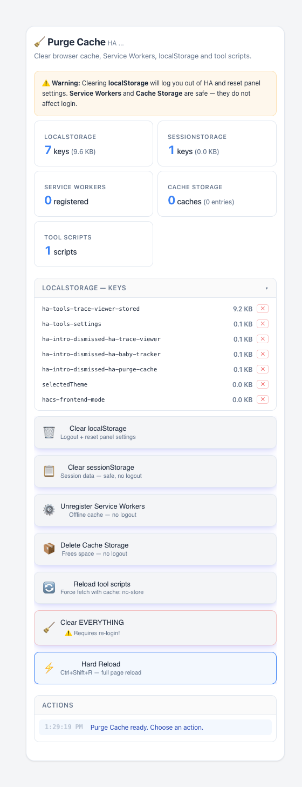
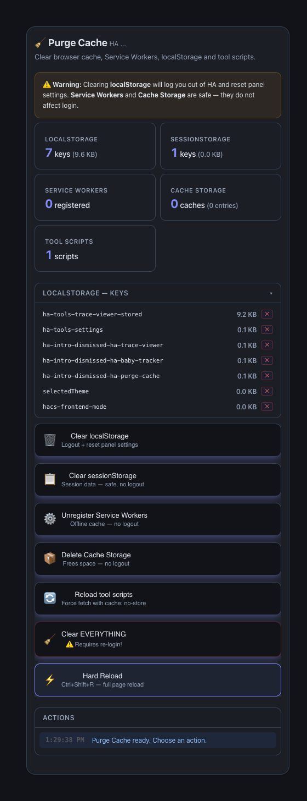

# Purge Cache


Fix "my dashboard won't update" in one click: inspect and clear browser
localStorage, sessionStorage, Service Workers and Cache Storage, and
force-reload HA Tools scripts — from a Lovelace card.

[](https://github.com/MacSiem/ha-purge-cache/releases) [](LICENSE)

## How it works

**Short version: it works automatically.** The card needs no configuration:

1. **Live browser stats.** On load it counts localStorage keys (with sizes),
   sessionStorage, registered Service Workers and Cache Storage entries for
   your HA frontend — and lists every localStorage key with a per-key delete
   button.
2. **Targeted or full cleanup.** Each storage type has its own button with a
   clear warning about what you lose (clearing localStorage logs you out of
   HA; Service Workers and Cache Storage are safe). **Clear EVERYTHING** runs
   all of them and hard-reloads the page.
3. **Everything is browser-local.** The card never touches your HA server
   config — it only clears *this browser's* cached state.

### What is automatic vs. manual

| Automatic | Manual |
|---|---|
| Counting storage / SW / cache stats | Choosing what to clear |
| Size per localStorage key | Confirming each destructive action |
| Hard reload after "Clear EVERYTHING" | — |

## Screenshots

| Light | Dark |
|---|---|
|  |  |

*Storage stats, the localStorage key browser and one-click cleanup actions.
Dark mode follows your Home Assistant theme automatically.*

## Installation

1. Open HACS → Custom repositories.
2. Add `https://github.com/MacSiem/ha-purge-cache` as category **Dashboard**
   (Lovelace plugin).
3. Install **Purge Cache** and reload your browser.

## Quick start

```yaml
type: custom:ha-purge-cache
```

That's it — no options are required.

## FAQ

**When do I need this?**
When a dashboard or HA Tools card won't pick up an update, a panel misbehaves
after an upgrade, or you want to reset frontend state without digging through
browser devtools.

**Will I get logged out?**
Only if you clear **localStorage** (your HA login token lives there) or use
**Clear EVERYTHING** — the card warns you first. sessionStorage, Service
Workers and Cache Storage are safe to clear.

**Does it change anything on my HA server?**
No. All actions are strictly browser-side; your configuration, automations
and history are untouched.

**Does this send data anywhere?**
No. Everything runs locally in your browser — no telemetry, no CDN assets.

## Changelog

See [CHANGELOG.md](CHANGELOG.md).

## Support

- [Buy Me a Coffee](https://buymeacoffee.com/macsiem)
- [PayPal](https://www.paypal.com/donate/?hosted_button_id=Y967H4PLRBN8W)

## License

MIT, see [LICENSE](LICENSE).
