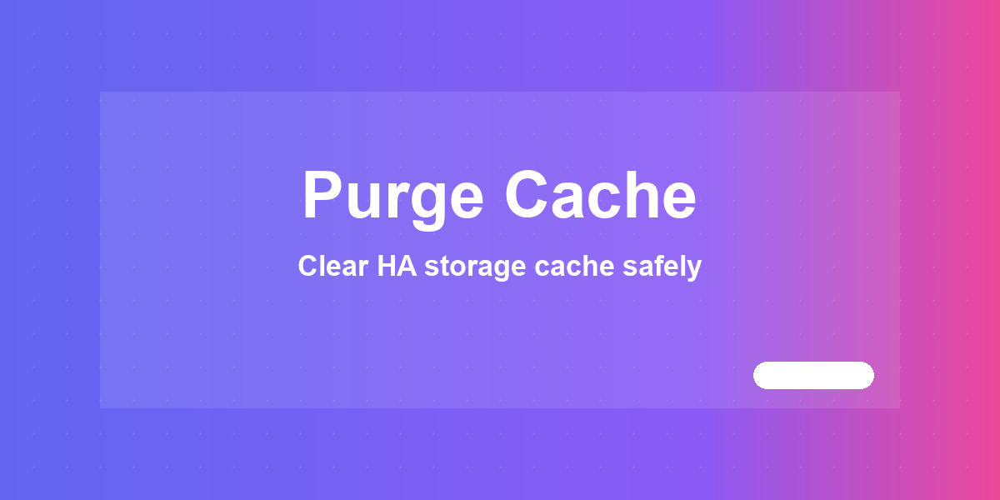
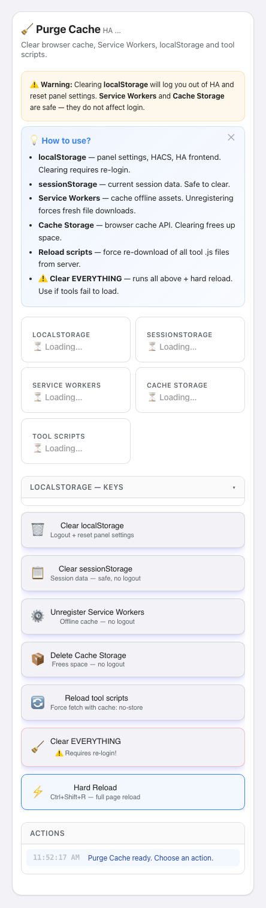

# 🧹 Purge Cache



Clear browser cache, Service Workers, localStorage and tool scripts.

[](https://www.home-assistant.io/) [](LICENSE) [](#changelog)

> Part of the [HA Tools](https://github.com/MacSiem) ecosystem — split into individual HACS-installable plugins.

## Screenshot



## Installation (HACS)

1. Open HACS → Frontend → ⋮ → **Custom repositories**
2. Repository URL: `https://github.com/MacSiem/ha-purge-cache` — Category: **Lovelace**
3. Install **Purge Cache** from HACS
4. Restart Home Assistant

## Usage

### Lovelace card

```yaml
type: custom:ha-purge-cache
```

### Optional sidebar panel (`configuration.yaml`)

```yaml
panel_custom:
  - name: ha-purge-cache
    sidebar_title: Purge Cache
    sidebar_icon: mdi:home-assistant
    url_path: ha-purge-cache
    js_url: /local/community/ha-purge-cache/ha-purge-cache.js
    embed_iframe: false
    config: {}
```

After restart, **Purge Cache** appears in the HA sidebar.

## Features

- Clear browser cache, Service Workers, localStorage and tool scripts.
- Bundled Bento Design System (light + dark mode, mobile-friendly)
- Self-contained — no shared HA Tools dependency
- Tool settings and dismissed-banner state are cached in browser `localStorage`
## Privacy

- No telemetry, no analytics, no tracking
- No external network calls, no CDN-hosted assets (system fonts only)
- No data leaves your device (no external network calls)
## Changelog

See [CHANGELOG.md](CHANGELOG.md).

## Support

If this tool makes your Home Assistant life easier, consider supporting development:

- [☕ Buy Me a Coffee](https://buymeacoffee.com/macsiem)
- [💳 PayPal](https://www.paypal.com/donate/?hosted_button_id=Y967H4PLRBN8W)

## License

MIT — see [LICENSE](LICENSE).
