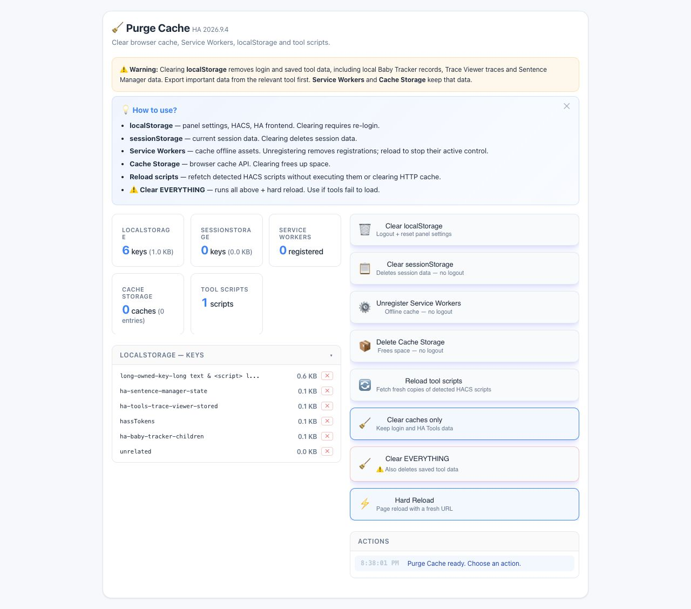
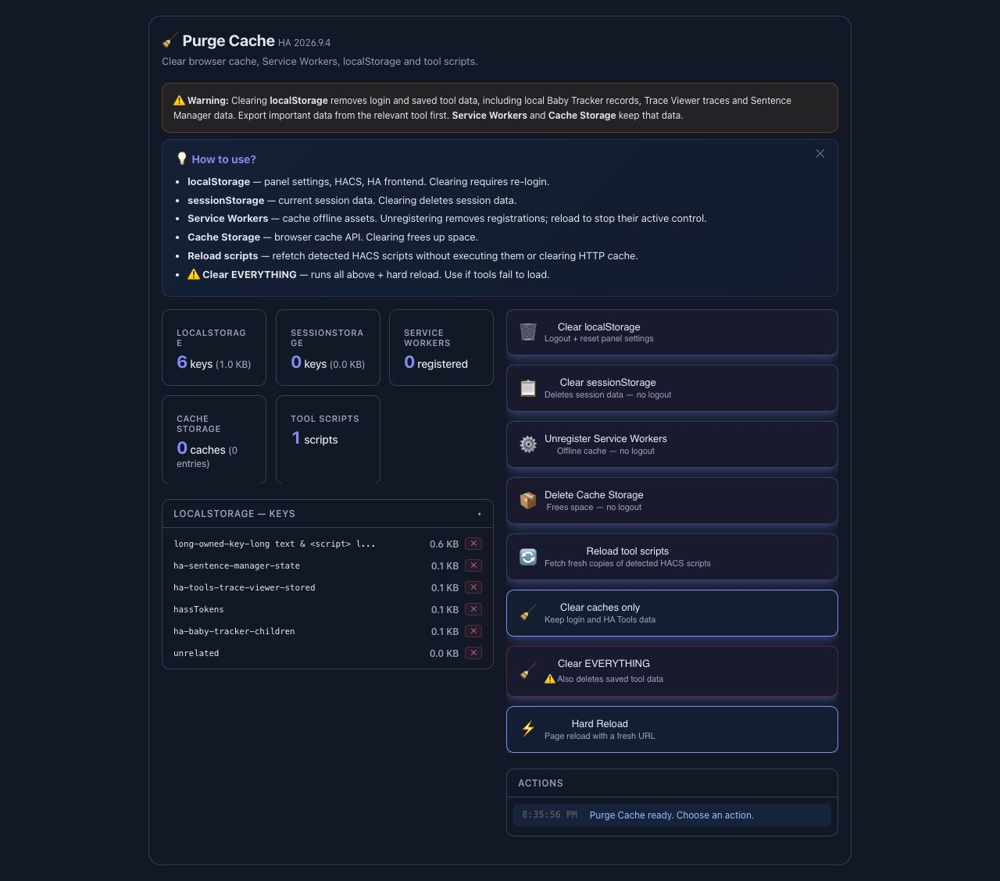

# Purge Cache


Fix "my dashboard won't update" in one click: inspect and clear browser
localStorage, sessionStorage, Service Workers and Cache Storage, and
refetch detected HA Tools scripts — from a Lovelace card.

[](https://github.com/MacSiem/ha-purge-cache/releases) [](LICENSE)

## How it works

**Short version: it works automatically.** The card needs no configuration:

1. **Live browser stats.** On load it counts localStorage keys (with sizes),
   sessionStorage, registered Service Workers and Cache Storage entries for
   your HA frontend — and lists every localStorage key with a per-key delete
   button.
2. **Targeted or full cleanup.** Each storage type has its own button with a
   clear warning about what you lose. **Clear caches only** removes Service
   Workers and Cache Storage, then reloads the page while retaining login and
   locally saved tool data. **Clear EVERYTHING** also removes localStorage and
   sessionStorage, then reloads the page.
3. **Everything is browser-local.** The card never touches your HA server
   config — it only clears *this browser's* cached state.

### What is automatic vs. manual

| Automatic | Manual |
|---|---|
| Counting storage / SW / cache stats | Choosing what to clear |
| Size per localStorage key | Confirming each destructive action |
| Reload after "Clear caches only" or "Clear EVERYTHING" | — |

If an action fails, the report stays visible and the card does not automatically reload. Retry after resolving the browser restriction, or reload manually. Unavailable APIs and denied reads are reported separately from measured empty storage.

## Screenshots

| Light | Dark |
|---|---|
|  |  |

*Synthetic browser storage stats, the localStorage key browser, separate
cache-only action and explicit warning before deleting saved tool data. Dark
mode follows your Home Assistant theme.*

## Installation

1. Open HACS → Custom repositories.
2. Add `https://github.com/MacSiem/ha-purge-cache` as category **Dashboard**
   (Lovelace plugin).
3. Install **Purge Cache** and reload your browser.

## Quick start

```yaml
type: custom:ha-purge-cache
```

No options are required. Optional configuration:

```yaml
type: custom:ha-purge-cache
title: Browser maintenance
show_support: false
```

`title` is shown literally and wraps within the card. `show_support: false` hides the optional administrator-only support link. You can also dismiss the instructions and support link in the card; dismissal persists when browser storage is available.

## FAQ

**When do I need this?**
When a dashboard or HA Tools card won't pick up an update, a panel misbehaves
after an upgrade, or you want to reset frontend state without digging through
browser devtools.

**Will I get logged out?**
Only if you clear **localStorage** (your HA login token lives there) or use
**Clear EVERYTHING**. Both can also erase local Baby Tracker records, saved
Trace Viewer traces, Sentence Manager data and other browser-only data. Use **Clear caches only** to
retain these. Browser Cache Storage is separate from the normal HTTP cache;
if a HACS JavaScript update still appears stale, update its Lovelace resource
URL or reload the frontend after HACS changes it.

**Does it change anything on my HA server?**
No. All actions are strictly browser-side; your configuration, automations
and history are untouched.

**Does this send data anywhere?**
Storage keys and values are not uploaded. The card has no telemetry or CDN assets. Reload tool scripts only refetches detected JavaScript from your own HA origin with `cache: no-store`; it does not execute those copies or clear the normal HTTP cache.

## Changelog

See [CHANGELOG.md](CHANGELOG.md).

## Support

- [Buy Me a Coffee](https://buymeacoffee.com/macsiem)
- [PayPal](https://www.paypal.com/donate/?hosted_button_id=Y967H4PLRBN8W)

The optional in-card support link is shown only to administrators. Dismiss it in the card or set `show_support: false` in the card configuration.

## License

MIT, see [LICENSE](LICENSE).

## Privacy and data

The card inspects browser storage for this Home Assistant origin. The cache-only action preserves localStorage; broader deletion choices can remove data saved by other cards. Read the confirmation and export important data first. Storage keys and values may contain private household information.

See [SECURITY.md](SECURITY.md) for safe vulnerability reporting and [NOTICE](NOTICE) for licensing notices.
